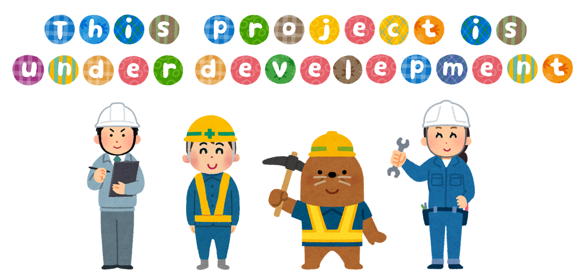

This is a chrome extension for tab/bookmarks manage/search/sync developed using Vue.js, aiming at realizing following features:

1. unified search across active/locally saved/remotely saved tabs/bookmarks on different devices/accounts.

## Glossary

- `tab` an object with at least two text attributes: url, and title.
- `session` an array of tabs.
- `open session` corresponds to an open window of current browser, containing one/multiple tabs. Example: `sessionsOpen` @ TabsOpen.js

- `local session` corresponds to a tab group stored in local extension storage.
- `remote session` corresponds to a tab group stored in a remote server.

